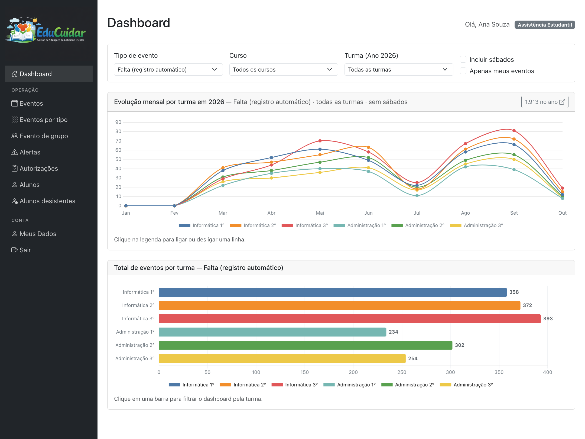
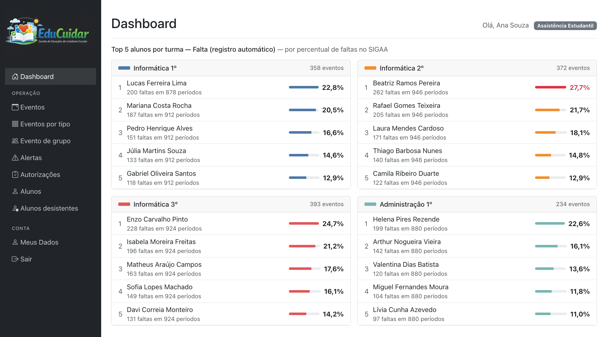
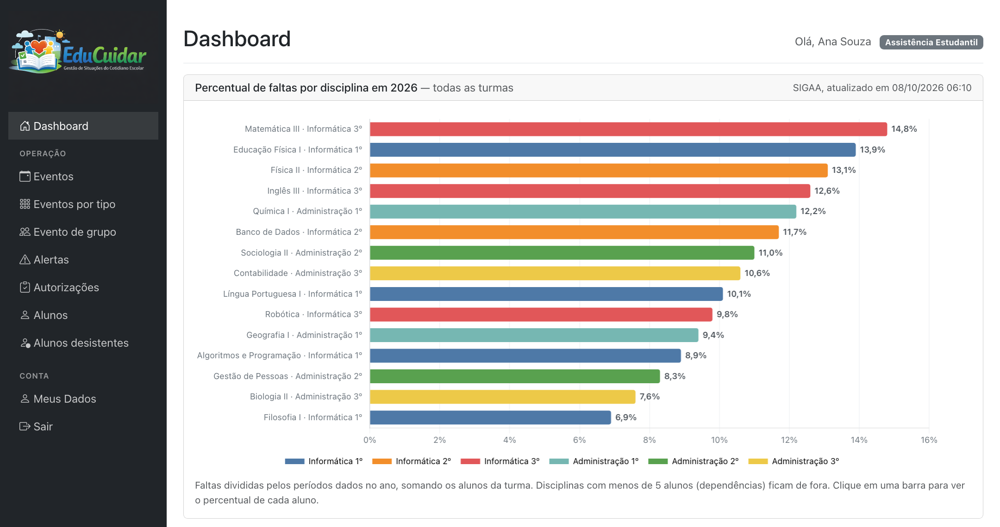
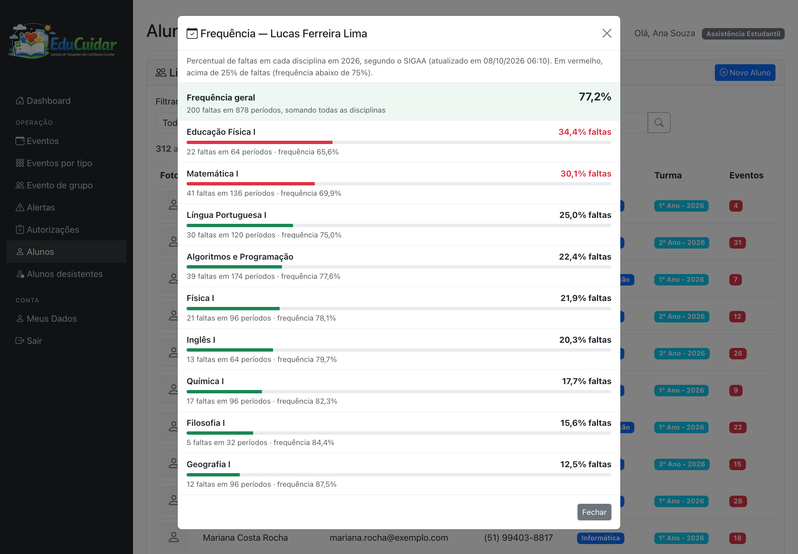
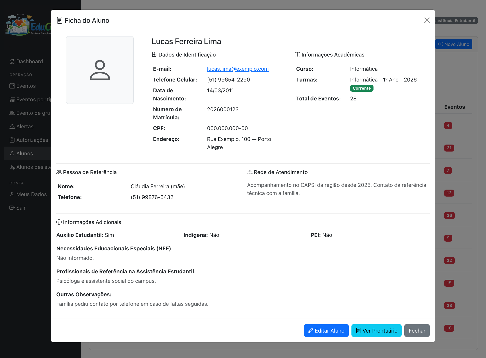
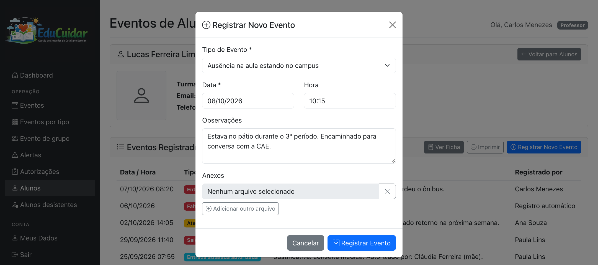
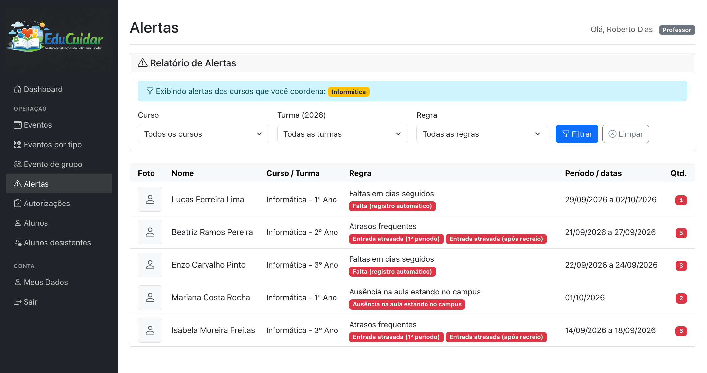
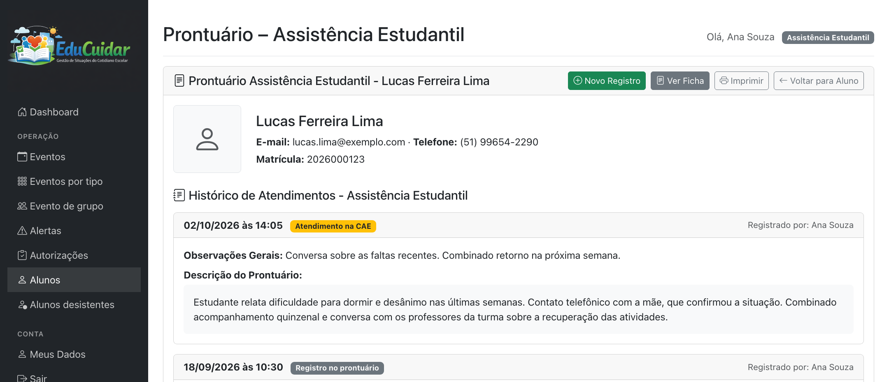
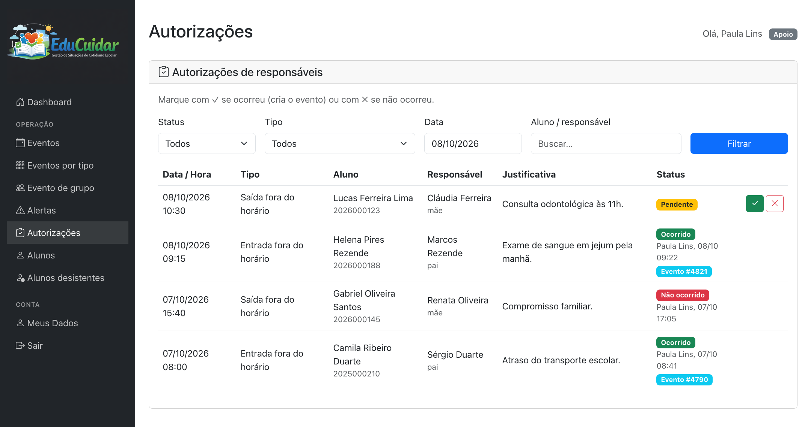
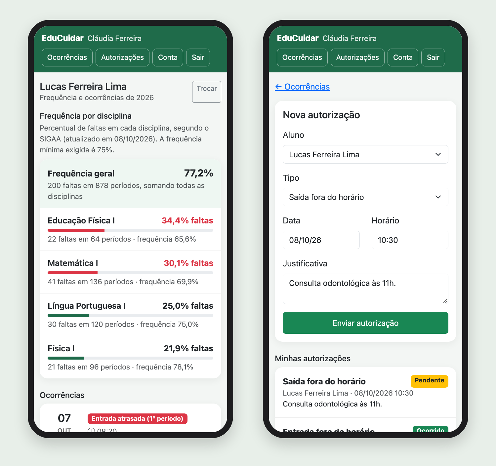

<p align="center"></p>

# EduCuidar

**Gestão de Situações do Cotidiano Escolar**

## O que é o EduCuidar

O EduCuidar é um sistema para escolas acompanharem o dia a dia dos seus estudantes, pensado especialmente para adolescentes do ensino médio. Boa parte do que acontece com eles na escola (um atraso, uma saída antes da hora, uma falta, uma conversa com a equipe) fica espalhado entre o apoio, os professores, a coordenação e a assistência estudantil.

O EduCuidar reúne essas informações num só lugar. Cada situação vira um **evento** registrado na ficha do aluno, com data, hora, tipo e quem registrou. A partir desses registros, o sistema mostra quem precisa de atenção, avisa a equipe quando um padrão preocupante aparece e mantém a família informada.

## Para que serve

O objetivo não é punir nem apenas controlar presença. É **cuidar melhor de cada estudante**, percebendo cedo quando alguma coisa não vai bem:

- **Enxergar o conjunto:** uma falta isolada diz pouco; faltas em dias seguidos, atrasos frequentes ou saídas repetidas da sala podem indicar um problema em casa, de saúde ou de adaptação. O sistema junta os registros de todos os setores e mostra esse quadro.
- **Agir a tempo:** alertas automáticos avisam a equipe quando um aluno entra num padrão de risco, e o acompanhamento da frequência mostra quem está se aproximando do limite de faltas antes que a reprovação aconteça.
- **Trabalhar em rede:** professores, apoio, coordenação de curso e assistência estudantil enxergam a mesma história do aluno, cada um com o nível de acesso adequado.
- **Aproximar a família:** os responsáveis acompanham as ocorrências e a frequência pelo celular, recebem um resumo diário por e-mail e podem avisar a escola sobre entradas e saídas fora do horário.

## Quem usa

| Quem | O que faz no EduCuidar |
|---|---|
| Professores e demais profissionais da escola | Registram eventos dos alunos, consultam fichas e frequência, acompanham o painel. |
| Apoio | Registra atrasos e saídas e confirma as autorizações enviadas pelas famílias. |
| Coordenação de curso | Recebe alertas e um resumo diário das ocorrências das turmas do seu curso. |
| Assistência estudantil | Mantêm um prontuário sigiloso de atendimentos e os dados sociais do aluno. |
| Famílias | Acompanham ocorrências e frequência e enviam autorizações pelo portal dos responsáveis. |
| Administração | Configura cursos, turmas, tipos de evento, regras de alerta e o envio de e-mails. |

Os alunos não usam o sistema: eles são acompanhados por ele.

## Como funciona no dia a dia

1. **Registro.** Quem presencia uma situação registra o evento em poucos cliques. As faltas podem ser lançadas na escola ou importadas automaticamente do sistema acadêmico, quando houver integração.
2. **Acompanhamento.** O painel mostra a evolução das ocorrências por turma, os alunos com mais faltas e as disciplinas com maior ausência.
3. **Alerta.** Quando um aluno entra num padrão definido pela escola (por exemplo, três dias seguidos de falta), o sistema gera um alerta para a equipe.
4. **Cuidado.** A equipe consulta a ficha, conversa com o aluno, registra o atendimento no prontuário e, se for o caso, aciona a família e a rede de atendimento.
5. **Comunicação.** Uma vez por dia, responsáveis e coordenadores recebem por e-mail um resumo do que aconteceu.

## Conhecendo as telas

> As telas abaixo usam **nomes e dados fictícios**. O visual é o mesmo do sistema.

### Painel geral

O painel abre com a visão da escola no ano: a evolução mensal de cada tipo de evento por turma e o total por turma. Os filtros permitem olhar um curso ou uma turma específica, e um clique numa barra leva direto aos registros daquela turma.



### Quem precisa de atenção

Logo abaixo, o painel lista os cinco alunos de cada turma em situação mais delicada. No caso das faltas, a ordem é pelo **percentual de faltas** sobre as aulas dadas, como o sistema acadêmico calcula, e não pela quantidade de registros. Assim, um dia com três períodos de aula pesa três vezes mais do que um dia com um período. Quem passa de 25% de faltas (frequência abaixo dos 75% exigidos) aparece em vermelho.



### Faltas por disciplina

O painel também mostra o percentual de faltas em cada disciplina. Isso ajuda a perceber, por exemplo, uma disciplina em que a turma inteira está faltando mais. Um clique na barra abre a lista dos alunos daquela disciplina, do pior para o melhor.



### Frequência de cada aluno

Na lista de alunos, um ícone vermelho de atenção indica quem já passou de 25% de faltas em alguma disciplina. A tela de frequência mostra a situação do aluno em cada disciplina, com os dados do sistema acadêmico, destacando onde ele corre risco de reprovar por falta.



### Ficha do aluno

A ficha reúne o que a equipe precisa saber para cuidar do estudante: dados de contato, turma, pessoa de referência na família, rede de atendimento (saúde, assistência social), auxílio estudantil, necessidades educacionais específicas e observações. A assistência estudantil tem, além disso, uma seção reservada com informações sociais e de saúde, que só ela vê.



### Registro de eventos

Cada aluno tem a sua linha do tempo de eventos. Para registrar um novo, basta escolher o tipo, a data e a hora e, se quiser, escrever uma observação e anexar documentos. Os tipos de evento são definidos pela escola: entrada atrasada, saída antecipada, ausência da sala estando na escola, atendimentos, entre outros. Também é possível registrar o mesmo evento para vários alunos de uma vez, como numa saída de campo.



### Alertas automáticos

A escola define as regras de alerta, por exemplo:

- faltas em três dias seguidos;
- cinco atrasos em sete dias;
- duas ausências da sala no mesmo dia.

O sistema verifica essas regras sempre que um evento é registrado e a cada importação de faltas do sistema acadêmico. Os alertas novos aparecem num aviso logo ao entrar no sistema, e o relatório completo pode ser filtrado por curso, turma e regra. Cada coordenador vê os alertas dos cursos que coordena.



### Prontuário sigiloso

Equipes como a assistência estudantil e o núcleo de atendimento a pessoas com necessidades específicas mantêm um prontuário de atendimentos de cada aluno. O texto do prontuário e os anexos só são vistos pela equipe dona do prontuário. Há também registros que ficam apenas no prontuário: não aparecem na lista de eventos, no painel, nos alertas nem para a família.



### Autorizações das famílias

Quando o aluno precisa chegar mais tarde ou sair mais cedo, o responsável avisa pelo portal, com a justificativa. O apoio vê os pedidos do dia e marca se a entrada ou saída aconteceu. Ao confirmar, o sistema registra automaticamente o evento na ficha do aluno, com quem autorizou e o motivo.



### Portal das famílias

Pais, mães e tutores têm um acesso próprio, pensado para o celular. Depois de se cadastrar e ter o cadastro aprovado pela escola, o responsável:

- acompanha a frequência do filho em cada disciplina;
- vê as ocorrências que a escola decidiu compartilhar;
- envia autorizações de entrada e saída fora do horário.



### Resumo diário por e-mail

Uma vez por dia, a partir de um horário definido pela escola, cada responsável recebe um e-mail com as ocorrências do dia dos seus filhos, e cada coordenador recebe as ocorrências das turmas do seu curso, separadas por turma. Quem não teve ocorrência no dia não recebe nada. Exemplo do e-mail ao coordenador:

```text
Resumo das ocorrências de 07/10/2026:

— Informática - 1º Ano —

- Lucas Ferreira Lima
  a) Entrada atrasada (1º período) (08:20)

— Informática - 2º Ano —

- Beatriz Ramos Pereira
  a) Saída antecipada (11:40)

Total: 2 ocorrência(s).
```

## Integração com o sistema acadêmico

O EduCuidar funciona por conta própria. A integração com o sistema acadêmico da escola é opcional e serve para trazer as faltas e a frequência sem que ninguém precise digitá-las de novo.

**Sem integração.** Tudo o que depende dos registros feitos na escola funciona normalmente:

- eventos;
- faltas lançadas como eventos;
- painel e alertas;
- ficha e prontuário;
- autorizações, portal das famílias e e-mails.

O que fica de fora são os percentuais de frequência por disciplina, que dependem das aulas dadas e das faltas registradas no sistema acadêmico.

**Com o SIGAA.** O EduCuidar já tem integração pronta com o SIGAA. Ele consulta o sistema em horários programados e traz:

- **as faltas de cada aluno, por disciplina e por dia**, que entram como eventos na ficha (e somem se forem abonadas ou corrigidas no SIGAA);
- **a frequência por disciplina**, com as aulas dadas e as faltas, usada no painel, na tela de frequência e no portal das famílias;
- **a lista de professores**, para facilitar o cadastro da equipe.

**Com outros sistemas.** A integração fica separada do restante do sistema. Para usar outro sistema acadêmico, basta escrever um novo conector que leia as faltas e a frequência desse sistema e as entregue ao EduCuidar no mesmo formato. Telas, alertas, portal e e-mails continuam iguais.

## Privacidade e sigilo

O EduCuidar lida com informações sensíveis de adolescentes, e o acesso é organizado para que cada pessoa veja só o que precisa:

- cada profissional tem um nível de acesso, e alguns só veem os eventos que eles mesmos registraram;
- o prontuário e os dados da assistência estudantil são restritos às equipes responsáveis;
- a escola escolhe quais tipos de evento as famílias podem ver e se as observações aparecem para elas;
- o cadastro de responsáveis só é liberado depois da aprovação da escola;
- o e-mail às famílias lembra que o sistema é um apoio à comunicação e que os fatos devem ser conversados com o adolescente.
